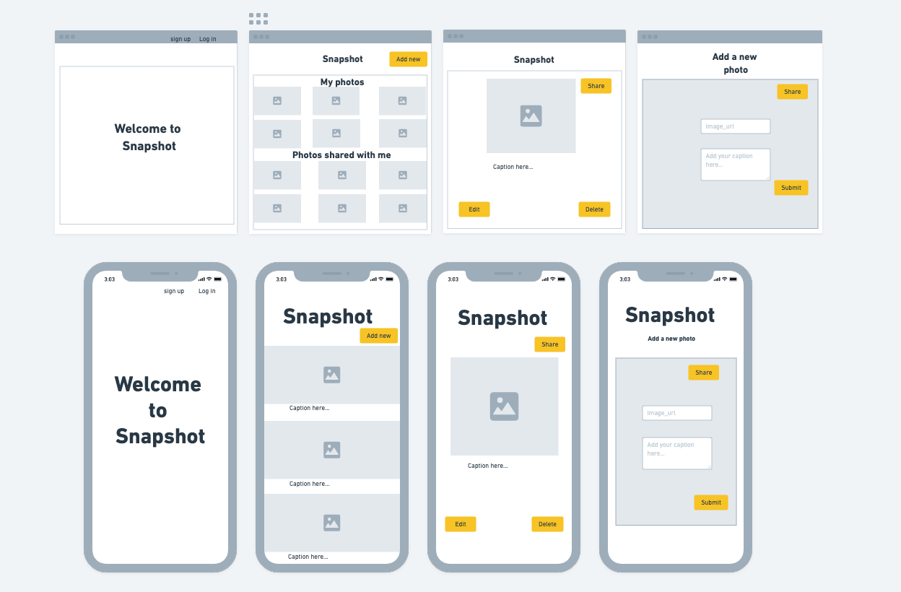

# Snapshot App 

Snapshot is a React + Typescript frontend application where the user can upload, edit, and share photos with friends.

### [Link to Snapshot](https://snapshot-frontend.netlify.app)

### Technologies Used

- React
- Typescript
- HTML
- CSS
- SCSS
- React - Bootstrap
- ImageKit CDN

### Component Architecture
[](https://mermaid.live/edit#pako:eNptkk9v4jAQxb9KNCevRCEN4V8OK1FSWlpYaFn2sE0PFjYQbWJHxlHLIr57nXGo3F1ySfLe740zMznCWjIOEWwy-bbeUaW9n3EiPHMNX4ZF8epdXX2_IfNSZ1x_s8ZNpXkjci9zXksjlJ5fEmgl8OpiMZkdFjup5b5GY5RvKzQq91xNWCs_FEh8Rm-RWRnXRqeSMq5cb0xGilPNPQS8mWQ0qw8Y289DG93hWqdSuOk7sjStXgrfoX9vfRtsrcQeafv6ZQgT8ivlb1im1ieoP1xqrxXhfcI--3xAGONui1Z-JKuCXW7x0c4H7f9atOkpiblZ2aX01C4GbSftuY3NyFilXLDz1mao_nDb2ljgn33PyVRu0_OU5nacVLCMo-6iC7JMt6IsanbhsNZw4aeqrizP_-DT18LGsDo0IOcqpykz__Sx0hLQO57zBCLzyKj6k0AiToajpZbLg1hDpFXJG1DiOOOUbhXNIdrQbG_UggqIjvAO0SBoBkG_F4Rd3w87nesGHCAK2p2mPwjCcNANB_0wDE4N-CulyfvNXrff7rX966ATBlUMi_1Gszrx9AHzgQQT)

### Frontend Route Table

| Route    | Element    | Loader |Action| Description|
| :---    | :----: | :----:    | :----   |:----   |
|/        | Home   | |         |Display Home page|
|/:userId/myPhotos | PhotosPage (Index) | userPhotosLoader | | Display all photos for the user |
|/:userId/myPhotos | PhotosPage (Create Photo modal) |  | createPhotoAction | Modal to create new photo |
|/:userId/myPhotos | PhotoCard (Share modal) |  | shareAction, unshareAction | Modal to share and unshare photo to user |
|/:userId/myphotos/:photoId | ViewPhotoPage (Show) | photoLoader |  | View selected photo |
|/:userId/myyphotos/:photoId | ViewPhoto (Update Photo modal) |  | updatePhotoAction  | Modal to update details about the photo |
|/:userId/myyphotos/:photoId | ViewPhoto (Delete Photo button) |  | deletePhotoAction  | Button to delete photo |
|/:userId/friends/ | FriendsPage (Index) | |  | Show list of users that can be friend or unfriended | 
|/login| LoginPage | | handleLogin | Handles logging in the user |
|/logout| Logout | | handleLogout | Handles logging out the user |
|/signup| SignUp | | handleSignup | Handles creating account for new user |

### Mockups

#### Trello Workspace
[TRELLO BOARD](https://trello.com/b/eR1U7DMT/capstone)

###### 2023 Karen Fernander |
